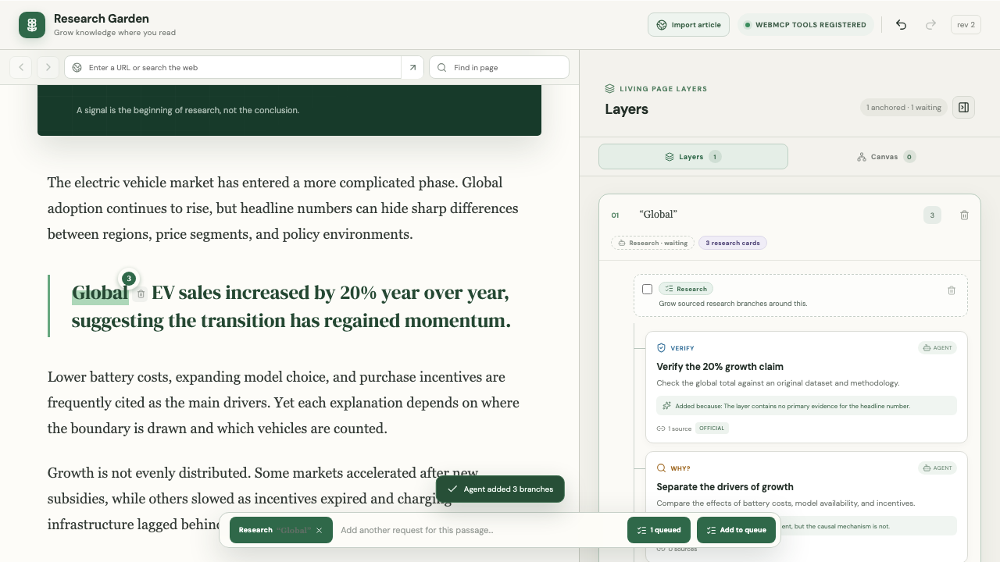
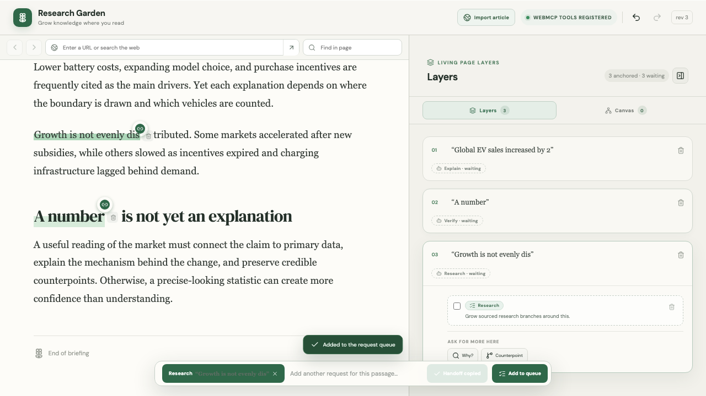
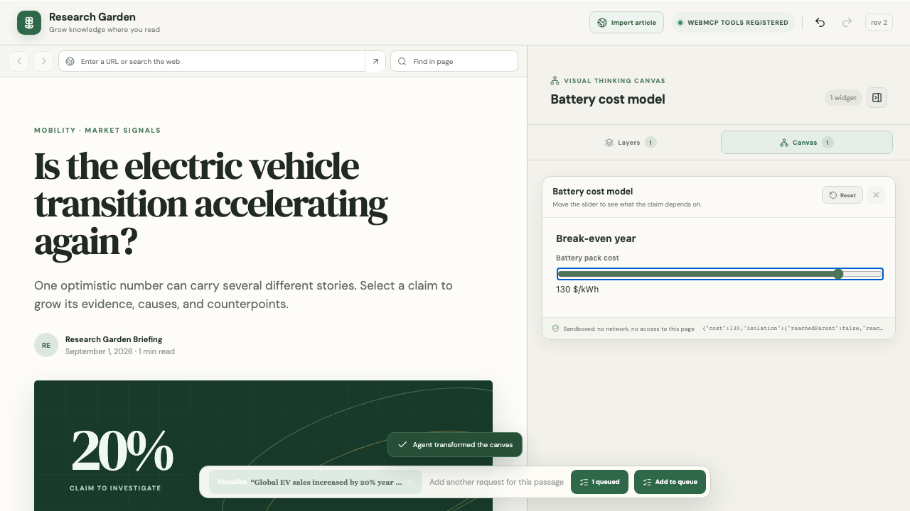

# Living Page

**Mark what you want to understand while you read. One sentence to your agent turns the page itself into the answer.**

Living Page is an agent-native reading surface built on [WebMCP](https://github.com/webmachinelearning/webmcp). The reader marks passages as they read — *explain this*, *verify this*, *show me this* — and those marks wait on the page as a queue. When the reader is done, they say one sentence in their agent chat: **“Process my marks.”** A WebMCP-capable agent reads the whole queue through tools the page registers, works through it in order, and writes its answers back into the article: an inline explanation beside the sentence it belongs to, a plain-language layer, a semantic highlight, a sourced verification, research branches, a picture strip, a map, or an interactive widget it wrote itself.

Nothing is copied to a clipboard. Nothing leaves the page until the reader asks. The answer arrives where the question was asked.

| | |
| --- | --- |
| **Live demo** | _`<add deployed URL before submitting>`_ — open it in ChatGPT’s in-app browser or a Chrome build with WebMCP enabled |
| **Demo video** | _`<add YouTube URL before submitting>`_ |
| **Hackathon** | [The WebMCP Challenge](https://webmcp.devpost.com) |
| **License** | [MIT](./LICENSE) |



---

## The problem

Understanding a hard page currently means leaving it. You copy a quote into a chat window, read the answer somewhere else, and come back to a page that has not changed and a place you have lost. The chat knows about your page; your page knows nothing about the chat. Every question costs a context switch, so most questions never get asked.

WebMCP inverts that. The page can hand an agent real tools, so the agent does not have to describe a change — it can make one. Living Page takes that literally: **the agent’s output is interface, not prose.** What it produces is anchored to the sentence that provoked it, is inspectable, is attributed, and can be undone.

## Try it in 90 seconds

1. Open the live demo in a WebMCP-capable browser. The header shows **WebMCP tools registered** once the page has handed over its tools.
2. Read the built-in article, or import any public article by URL (a PDF URL works too).
3. Select a sentence. Choose **Explain**, **Simplify**, **Visualize**, **Research**, or **Verify** — or type anything the five presets do not cover in the ask bar. With nothing selected, the ask bar asks about the whole article; with **Explain a term** on, name a word and the agent finds every place it matters.
4. Keep reading and keep marking. Each mark becomes a durable text anchor with a **waiting** badge in the Layers panel. Still nothing has been sent.
5. Tell your agent: **“Process my marks.”** Watch the article change under you.

## How WebMCP is used

The page registers **19 tools** on `document.modelContext`. They are not a wrapper around a chat prompt — they are the page’s own editing model, exposed.

**Reading — how the agent finds out where the reader is**

| Tool | What it answers |
| --- | --- |
| `get_pending_requests` | The reader’s queue in order: scope, anchor, exact quote, surrounding context, what is already attached, and which tools fit the intent |
| `get_article_blocks` | The article as addressable blocks with exact text, so a quote can be copied verbatim rather than approximated |
| `get_page_context` | Article, current selection, anchors, and the graph revision |
| `get_current_selection` | The durable selection, its surrounding text, position, and anchor |
| `get_visible_page_context` | What is actually on screen: visible text, active layers, focus, preview, canvas type and card |
| `get_canvas_state` | Canvas state on its own — including the live map viewport, the markers currently on screen, and a widget’s reader-set state |
| `get_research_layer` | Compact nodes and source provenance for one anchor or the whole layer |

**Writing — what the agent may change**

| Tool | What it does |
| --- | --- |
| `anchor_passage` | Anchors an exact quote on the reader’s behalf — only inside a request the reader queued |
| `resolve_request` | Clears one queued request as done or skipped, with a one-line summary |
| `insert_inline_explanation` | An explanation beside the original passage |
| `insert_simplified_layer` | Reversible plain language that never replaces the original |
| `add_highlight` | A restrained semantic highlight with a stated reason |
| `add_verification` | A cautious, source-backed verification state |
| `insert_image_layer` | A strip of sourced pictures beside the passage |
| `create_research_nodes` | A batch of linked research branches, created atomically |
| `add_research_source` | An exact source URL and provenance on a node |
| `create_visualization` / `update_visualization` | Fills the one canvas with a Map or a sandboxed Interactive widget |
| `set_map_view` | Pans, zooms, or flies the map without resending markers |

Five design decisions carry most of the WebMCP weight:

- **The queue is the collaboration primitive.** A mark is not a message. `get_pending_requests` hands the agent a batch of intents with the exact text each one is about, so one sentence of chat covers a whole reading session and the round trip stops being per-question.
- **Anchoring is the reader’s act, and the exception is narrow.** A question about the whole article has no passage to attach to, so an agent may derive anchors — but `anchor_passage` requires the `requestId` of a request still pending, it supplies words rather than positions, the page locates the quote itself and refuses one it cannot find, and one request yields at most ten anchors. **An invented quote cannot become an anchor.** Anchors made this way are labelled *Agent anchored* and are removed and undone like the reader’s own.
- **The handshake is explicit.** `resolve_request` is how the agent says a page change actually landed. Badges clear as work completes, and resolved entries stay listed with what the agent said it did — so a skipped request is visible as a skip, not as silence.
- **Writes are revision-guarded and reversible.** `create_research_nodes` takes a `baseRevision` and rejects a stale one. Every agent operation lands as a single Undo step; removing an anchor cascades through its layers, cards, and sources, and Undo restores the whole operation. Read tools carry `readOnlyHint` and `untrustedContentHint`.
- **The agent can write interface, not just text.** `create_visualization` with `type: "interactive"` takes one self-contained document and runs it in a sandbox beside the article — a model the reader can operate, a chronology, a comparison they can re-sort. The reader’s position inside that widget comes back through `get_canvas_state`, so the next question can be answered from the slider they actually moved.

## What lands on the page

**Layers** is the source of truth: every anchored passage with the inline explanations, simplifications, highlights, verifications, image strips, and research cards attached to it, plus the marks still waiting. Selecting a row scrolls the article back to the sentence it belongs to.



**Canvas** holds one visual surface, and what the agent last sent is what shows. There is no view switcher and it stays empty until an agent builds something.

- A **Map** is host-drawn with Leaflet and OpenStreetMap tiles: numbered markers, a legend in the same order, and research cards behind each pin. Coordinates come from the agent; the page never geocodes and never reads device location.
- An **Interactive** widget is HTML the agent wrote, running in an isolated frame. `allow-scripts` and nothing else, so no `allow-same-origin`, an opaque origin, no access to this page’s DOM, storage, or cookies — and a `default-src 'none'` CSP inside the frame, so no network at all. It talks back through exactly two calls: `livingPage.setState(value)` and `livingPage.openCard(nodeId)`.



Pictures never go on the canvas — the sandbox cannot load an external image, and beside the sentence is where the reader wants them anyway.

## The research browser

Imported articles form a small browser. The Worker produces two synchronized forms from the same Readability DOM: structured blocks for research, and a safe static snapshot that keeps the source’s classes, images, inline styles, and a bounded set of HTTPS stylesheets. Scripts, forms, embeds, local-network targets, unsupported content types, and oversized responses are rejected.

Every `<a href>` resolves against the article’s own URL, and a click re-imports the destination through the same checks instead of letting untrusted content navigate the frame. Back and Forward restore the complete per-page research document — anchors, marks, layers, sources, canvas, and Undo history — for up to six recent pages. Type a search phrase instead of a URL and it becomes a document-scoped web-search mark for the agent: the page does not pretend that tool registration lets it launch an agent by itself.

**PDFs work too.** A PDF URL imports into the same `ArticleDocument`, so anchoring, marks, layers, cards, and canvas work on it unchanged; the worker rebuilds paragraphs from placed lines, repairs hyphenation, drops running heads and folios, and refuses a scan with no text layer rather than importing a blank article. See [docs/architecture.md](./docs/architecture.md#pdf-import) for what it can and cannot promise.

## Safety model

- **The article is never executable.** Imported text is extracted as structured text; scripts, forms, and embeds are dropped at import. The only code that runs is code an agent wrote for the reader’s own request, and it runs walled off from the page beside it.
- **Import is fetched server-side with hard limits**: HTTP(S) only, no credentials in URLs, no localhost, private, or internal hosts, no non-standard ports, redirect and size caps, content-type checks, 10 MB / 60 pages for PDFs.
- **Agent writes are bounded**: exact-quote anchoring only, ≤ 10 anchors per request, ≤ 250 map markers with real WGS84 coordinates, HTTP(S) source URLs, ≤ 60,000 characters of widget HTML, ≤ 4,000 characters of widget state.
- **Everything is local and reversible.** Research data, layers, and canvas state persist in `localStorage` and share one reversible history.

## Verification

```bash
npm test        # 44 unit tests
npm run test:e2e # 18 end-to-end tests
npm run lint
npm run build
```

The end-to-end tests inject a browser-side WebMCP host and **execute the actual registered tools** — they are not mocks of the flow. They drive an agent through anchoring, inline explanation, simplification, highlight, sourced verification, image layers, research branches, map markers and viewport control, a sandboxed widget the reader then operates, grouped Undo/Redo, persistence across reload, and browser console health; and they check the refusals: an invented quote, an unprompted anchor, an external script inside a widget, pictures pushed onto the canvas. The full inventory is in [docs/architecture.md](./docs/architecture.md#verification).

## Local development

```bash
npm ci
npm run dev
```

**Stack:** React 19 · TypeScript · Vite · Cloudflare Worker (`/api/import`) · Mozilla Readability · linkedom · unpdf · Leaflet · Playwright · Vitest.

```
src/
  webmcp.ts             the 19 tools registered on document.modelContext
  model.ts              anchors, layers, request queue, revisions, undo
  research-context.tsx  the single store every tool and view reads
  App.tsx               reading surface, selection, ask bar, Layers panel
  article-surface.ts    anchoring across the native reader and the snapshot
  imported-page-frame   the safe static snapshot of an imported page
  map-canvas.tsx        Leaflet map canvas and its live viewport
  interactive-canvas    the sandboxed agent-authored widget frame
worker/
  index.ts              /api/import: URL safety checks and HTML extraction
  pdf-text.ts           PDF paragraph reconstruction
tests/
  unit/                 model, HTML import, PDF import
  e2e/                  the WebMCP host injection suite
docs/                   architecture notes, submission draft, screenshots
```

## Known limits

- Agent tool discovery needs a WebMCP-capable browser (ChatGPT’s in-app browser, or Chrome with WebMCP enabled). The reading workspace itself works in any current desktop browser.
- Login-walled, paywalled, or JavaScript-rendered pages, and snapshots over 400,000 characters, fall back to the structured reader rather than the styled snapshot.
- Two-column and heavily tabular PDFs read out of order; there is no OCR for scans.
- Web search happens on the agent’s side. The page queues the request and says so.

## License

[MIT](./LICENSE)
